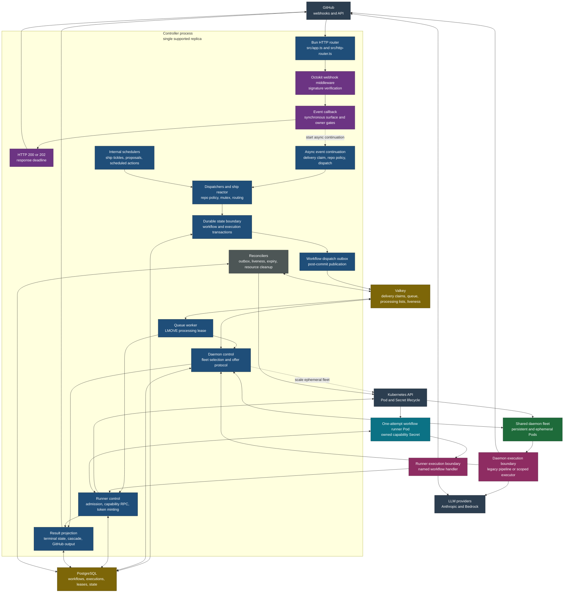
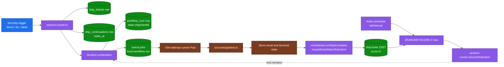
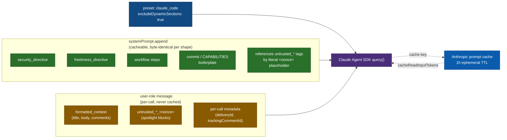

# Architecture

A single controller process receives GitHub webhook events, acknowledges within ten seconds, and asynchronously dispatches execution. The controller is the control plane and the only component with PostgreSQL, Valkey, GitHub App key, and Kubernetes authority. Repository work runs outside that boundary. Structured `workflow-run` jobs use one-attempt Kubernetes runner Pods. Legacy and scoped jobs use the shared daemon fleet.

## System topology

Solid arrows show the ordinary control or data path. Dotted arrows show asynchronous dispatch or scaling. PostgreSQL remains the durable authority; Valkey provides bounded idempotency, wake-up, queue, and liveness mechanisms.

## Request lifecycle

```mermaid
flowchart TB
    WebhookDelivery["GitHub webhook delivery"]:::external
    VerifySignature["Verify HMAC signature<br/>route subscribed event"]:::guard
    InvokeCallback["Invoke subscribed callback"]:::guard
    SynchronousGates["Run synchronous gates<br/>event surface, bot sender, allowed owner"]:::guard
    Acknowledge["Return HTTP 200 or 202<br/>within ten seconds"]:::guard
    AsyncContinuation["Start fire-and-forget continuation"]:::control
    DeliveryClaim["Apply delivery claim on guarded paths<br/>before durable or external work"]:::guard
    RouteKind{"Dispatch path"}:::decision
    ShipReactor["Ship reactor<br/>wake durable continuation"]:::control
    WorkflowCommit["PostgreSQL transaction<br/>workflow_runs plus executions"]:::store
    DaemonReceipt["Create execution receipt<br/>legacy or scoped payload"]:::store
    LegacyTriage["Legacy triage and scaler<br/>heavy or queue overflow"]:::control
    PublishOutbox["Publish committed workflow<br/>retryable dispatch outbox"]:::control
    SharedQueue["Valkey queue:jobs"]:::store
    ProcessingLease["Queue worker LMOVE<br/>instance processing list"]:::control
    QueuedKind{"Queued job kind"}:::decision

    RunnerClaim["Atomic PostgreSQL admission<br/>capacity, attempt, absolute deadline"]:::control
    RunnerResources["Create bare Pod<br/>read UID, create owned Secret"]:::control
    RunnerRegister["Capability-scoped WSS registration<br/>deliver repository token once"]:::guard
    RunnerWork["Named workflow handler<br/>isolated checkout, agent and MCP as required"]:::runner
    RunnerResult["workflow-runner:result<br/>validated terminal message"]:::runner
    RunnerTerminal["Persist attempt and execution result<br/>before result ACK"]:::store
    RunnerCleanup["Delete exact Pod and Secret<br/>with UID preconditions"]:::recovery

    DaemonSelect["Select active daemon<br/>capabilities, draining state, load"]:::control
    DaemonOffer["job:offer or scoped-job:offer<br/>offer timeout and retry"]:::control
    DaemonAccept["job:accept then job:payload<br/>installation token and context"]:::guard
    DaemonWork["Legacy pipeline or scoped executor<br/>unique checkout, agent and MCP as required"]:::daemon
    DaemonResult["job:result or scoped-job:completion<br/>validated completion message"]:::daemon
    DaemonTerminal["Fence daemon ownership<br/>finalize execution receipt"]:::store

    Projection["Reconcile terminal state<br/>cascade, locks, tracking projection"]:::control
    GitHubEffects["GitHub API effects<br/>comments, reviews, commits, pull requests"]:::external
    RecoveryLoop["Periodic recovery<br/>outbox, lease expiry, disconnected daemons"]:::recovery

    WebhookDelivery --> VerifySignature --> InvokeCallback --> SynchronousGates
    SynchronousGates --> Acknowledge
    SynchronousGates -.->|"return void and continue asynchronously"| AsyncContinuation
    AsyncContinuation --> DeliveryClaim --> RouteKind
    RouteKind -->|"ship wake"| ShipReactor
    ShipReactor --> WorkflowCommit
    RouteKind -->|"structured workflow"| WorkflowCommit
    RouteKind -->|"legacy request"| LegacyTriage
    LegacyTriage --> DaemonReceipt
    RouteKind -->|"scoped or scheduled job"| DaemonReceipt
    WorkflowCommit --> PublishOutbox --> SharedQueue
    DaemonReceipt --> SharedQueue
    SharedQueue --> ProcessingLease --> QueuedKind

    QueuedKind -->|"workflow-run"| RunnerClaim
    RunnerClaim --> RunnerResources --> RunnerRegister --> RunnerWork
    RunnerWork --> RunnerResult --> RunnerTerminal --> Projection
    RunnerTerminal --> RunnerCleanup

    QueuedKind -->|"legacy or scoped"| DaemonSelect
    DaemonSelect --> DaemonOffer --> DaemonAccept --> DaemonWork
    DaemonWork --> DaemonResult --> DaemonTerminal --> Projection

    RunnerWork --> GitHubEffects
    DaemonWork --> GitHubEffects
    Projection --> GitHubEffects
    RecoveryLoop -.->|"republish stale outbox"| SharedQueue
    RecoveryLoop -.->|"expire fenced attempt"| RunnerTerminal
    RecoveryLoop -.->|"fail orphaned execution"| DaemonTerminal
    RecoveryLoop -.->|"retry owned cleanup"| RunnerCleanup

    classDef external fill:#2c3e50,stroke:#17202a,color:#ffffff
    classDef guard fill:#6c3483,stroke:#4a235a,color:#ffffff
    classDef control fill:#1f4e79,stroke:#102a43,color:#ffffff
    classDef store fill:#7d6608,stroke:#4d3f05,color:#ffffff
    classDef daemon fill:#1e6b3a,stroke:#0f3d21,color:#ffffff
    classDef runner fill:#0b7285,stroke:#064653,color:#ffffff
    classDef decision fill:#9c640c,stroke:#633f08,color:#ffffff
    classDef recovery fill:#4d5656,stroke:#2c3333,color:#ffffff
```

The webhook middleware verifies the signature, invokes the subscribed callback, and waits only for the callback's return. Event handlers run their cheap synchronous gates before returning `void`, then start a fire-and-forget continuation for delivery claims and dispatch. The HTTP acknowledgement and that continuation can overlap. Neither branch waits for repository execution.

The two worker rails share the queue and durable execution accounting, but not execution authority or ordinary GitHub output ownership. A structured runner must transfer recovery authority to its PostgreSQL attempt before the processing-list item is released; the controller then stores and projects its terminal result. A daemon performs its GitHub effects directly and remains tied to its execution receipt and exact daemon incarnation through the offer, payload, and completion sequence.

## Key concepts

- **Async processing.** The webhook callback runs synchronous event-surface and owner-authorization gates, starts its side-effecting continuation without awaiting it, and returns so the middleware can acknowledge within ten seconds. Delivery claims and dispatch run in that continuation and can overlap the HTTP response. (`router.ts processRequest` is the equivalent path for the dev-only `/api/test/webhook` endpoint, not production.)
- **Webhook delivery idempotency (issue #202).** GitHub is at-least-once: a delivery (auto-retry or operator redelivery) replays with the same `X-GitHub-Delivery` for up to 3 days. The four side-effecting handlers (`events/issue-comment.ts`, `events/review-comment.ts`, the label branches of `events/issues.ts` + `events/pull-request.ts`) call `claimDelivery(deliveryId)` (`src/webhook/idempotency.ts`) at the top of their dispatch path, before any LLM call, `workflow_runs` insert, or GitHub write. It is a Valkey `SET key 1 NX EX 259200` claim: `true` exactly once per delivery, `false` (and an early return) on a redelivery. It is **fail-open**, when Valkey is unconfigured or disconnected (gated on `isValkeyHealthy()`) it returns `true`, degrading to at-least-once rather than dropping or blocking webhooks. `events/review.ts` is exempt (idempotent reactor wake only). The durable backstop behind the best-effort Valkey layer is the `idx_workflow_runs_inflight` partial-unique index: the dispatcher rejects a second in-flight run for the same workflow+target even when the Valkey claim was skipped. The legacy in-memory `Map` + `isAlreadyProcessed` tracking-comment scan was retired in issue #211 (it only ever guarded the dev-test-only `router.ts processRequest` path, which production handlers bypass). `DATABASE_URL` is required to persist execution / dispatch history and the in-flight guard across restarts. Two branches claim a **suffixed** key rather than the bare delivery id, because `claimDelivery` is one-shot per key and `pull_request.synchronize` fans out to more than one consumer: `` `${deliveryId}:config-check` `` for the PR config validator and `` `${deliveryId}:auto-review` `` for the auto-review dispatch. A shared key would let whichever branch ran first starve the other.
- **One request, one clone.** Each execution clones the repo into a unique temp directory under `CLONE_BASE_DIR`, on a one-attempt runner Pod for structured workflows and on a shared daemon for legacy or scoped jobs. Claude operates on local files via `cwd`. A sibling `${workDir}-artifacts` directory holds workflow summaries outside the checkout. Both directories are removed in the pipeline's `finally` block.
- **GitHub credentials are repository-scoped at the runner boundary.** In App mode the controller mints an installation token restricted to the target repository and sends only that token to the runner. The runner never receives the App private key. Structured workflows fail closed when `GITHUB_PERSONAL_ACCESS_TOKEN` is configured because a PAT cannot be narrowed to one repository by the controller. Legacy and scoped shared-daemon jobs retain the existing token-resolution behavior.
- **Auto-review on push.** `pull_request.synchronize` can dispatch `review` with no label and no mention, gated on two keys that must agree: the server's `AUTO_REVIEW_USERS` allowlist (which logins may trigger it) and the repo's `workflows.review.auto` (whether this repo wants it). The env half exists because auto-review _widens_ what the bot does, and the `.github-app.yaml` `triggers:` block is narrowing-only by contract; the repo half exists because the env allowlist is server-wide. It matches the authenticated **pusher** (`payload.sender.login`), deliberately not the commit author the ship reactor resolves alongside it: the author is derived from a settable commit email, and this is an authorization decision. Three further guards keep it from feeding itself, all silent: our own pushes are skipped (`resolve` pushes a commit per fix), pushes whose diff fingerprint is unchanged are skipped (a rebase), and a review already in flight wins via `idx_workflow_runs_inflight` rather than queueing. Dispatch goes through `dispatchWorkflowByName({ auto: true })`, which suppresses every refusal comment and the `bot:*` label mutex, so an auto-trigger never writes to the PR except through the review itself.
- **The controller never runs repository code.** Shared daemons execute legacy and scoped jobs. Structured `workflow-run` jobs execute in one-attempt Pods. The controller owns PostgreSQL, Valkey, GitHub App keys, runner admission, Kubernetes resources, and result projection.
- **The supported topology is one controller replica.** `src/orchestrator/queue-worker.ts` leases queue items with `LMOVE`. Workflow admission and recovery authority are committed in PostgreSQL before the processing-list item is released. Startup recovers this instance's list, and every liveness-reaper pass returns items from lists whose 60-second orchestrator heartbeat has expired. The repository does not implement distributed controller session ownership or a distributed admission semaphore.
- **The daemon image enforces a Linux parent-process boundary.** A compiled preload guard sets `PR_SET_DUMPABLE=0` before Bun application code. Shared daemons and workflow runners fail startup unless an empty-environment same-UID child receives `EACCES` or `EPERM` while reading the parent's `/proc/<pid>/environ`. The GitHub release workflow runs this exact probe against every pushed daemon image digest on both supported architectures. The GitLab main-branch publisher loads its amd64 image locally, runs the same probe, and pushes only after it passes.
- **MCP servers.** Tracking-comment updates, inline PR reviews, scoped review-thread resolves, daemon-capability reports, repo-memory, and (optionally) Context7 library docs are exposed as MCP servers the agent can call. Git changes are made via the Bash tool against the cloned repo, not through a dedicated MCP server.
- **Destructive Bash is runtime-gated.** The agent runs under `bypassPermissions` with the Bash tool allowed, so prompt-only bans alone do not stop a prompt-injected force-push or merge. A `PreToolUse` hook (`src/core/hooks/forbidden-bash.ts`, wired in `src/core/executor.ts`) denies any Bash command matching the shared `FORBIDDEN` set (force-push, `git reset --hard`, branch delete, history rewrite, `gh pr merge`, GraphQL merge mutations) before it executes. The pattern set is shared with the static `check:no-destructive` CI guard via `src/utils/forbidden-bash.ts`, so build-time and runtime gates cannot drift. A deny emits an `agent.hook.denied` log line.

## Dispatch flow

Migration `017_workflow_run_leases.sql` records the protocol that actually owns each execution. The queue worker branches before daemon selection: `workflow-run` items go to an isolated runner, while legacy and scoped items retain the shared-daemon offer protocol.

### Two targets, five reasons

Canonical source: `src/shared/dispatch-types.ts`.

- `DispatchTarget` = `"daemon"` for shared jobs or `"workflow-runner"` for structured workflows.
- `DispatchReason` is one of:

| Reason                      | When the router sets it                                                                                        |
| --------------------------- | -------------------------------------------------------------------------------------------------------------- |
| `persistent-daemon`         | Routed to an existing persistent daemon. The default, hot path.                                                |
| `ephemeral-daemon-triage`   | Triage flagged the job heavy → orchestrator spawned an ephemeral daemon Pod.                                   |
| `ephemeral-daemon-overflow` | Queue length ≥ `EPHEMERAL_DAEMON_SPAWN_QUEUE_THRESHOLD` and persistent pool saturated → spawn drains overflow. |
| `ephemeral-spawn-failed`    | Spawn was required but the K8s API call failed. Job rejected with a tracking-comment infra error.              |
| `workflow-runner`           | A structured workflow was committed for one isolated runner attempt.                                           |

### Scale-up model

The fleet is two-tiered, see [`../operate/runbooks/daemon-fleet.md`](../operate/runbooks/daemon-fleet.md) for the operational view. The decision rule:

1. **Triage.** Single-turn Haiku call returns `{heavy, confidence, rationale}`. `heavy=true` is one trigger.
2. **Overflow.** `queue_length ≥ EPHEMERAL_DAEMON_SPAWN_QUEUE_THRESHOLD` **and** persistent free slots = 0 is the other trigger.
3. **Cooldown.** Spawns are rate-limited by `EPHEMERAL_DAEMON_SPAWN_COOLDOWN_MS`. During cooldown, heavy/overflow signals do **not** spawn: the job falls back to `persistent-daemon` and waits.
4. **Spawn.** When both a trigger fires and cooldown has elapsed, the orchestrator calls the K8s API to create a bare Pod with `DAEMON_EPHEMERAL=true`. Only a true K8s API failure yields `ephemeral-spawn-failed`.

The newly-spawned ephemeral daemon connects via WebSocket, registers with `isEphemeral: true`, claims the job, runs it, then drains and exits after `EPHEMERAL_DAEMON_IDLE_TIMEOUT_MS`.

Every shared-daemon boot uses a new UUID. On socket close, the controller immediately removes that socket from its local connection, daemon-info, heartbeat, and dispatch state so it cannot receive more work. It then starts a serialized asynchronous cleanup, and same-ID registration waits for that cleanup before becoming current. One PostgreSQL transaction locks the exact daemon row, marks it inactive, fails its attempt-less workflow rows and queued/offered/running execution receipts, creates pending public-failure receipts, and releases matching scheduled-action locks. The controller projects those receipts immediately and retries missed projections from PostgreSQL, then removes the best-effort Valkey registry entry. The liveness reaper applies the same exact-incarnation database cleanup if no close callback arrives, including direct or scoped execution receipts that have no `workflow_runs` row. Controller shutdown stops new connections and drains pending registration and disconnect work before closing the database.

## Isolated workflow runners

Workflow producers commit the `workflow_runs` row and matching `executions` row in one PostgreSQL transaction. Queue publication happens after commit. `dispatch_enqueued_at` is the last successful wake-up reconciliation time, not proof that Valkey retained the item. A null or stale timestamp makes the periodic reaper reconstruct the byte-stable job from PostgreSQL and atomically ensure that one matching copy exists in either the shared queue or this controller's processing list. Publication failures increment `dispatch_retry_count`. Exceeding `JOB_MAX_RETRIES` or `WORKFLOW_DISPATCH_TIMEOUT_MS` fails the queued workflow and execution, releases the target lock, and stores a retryable `dispatch-expired` public projection. Capacity deferral moves the queue bytes unchanged and does not consume that publication retry budget. If a controller crashes after `LMOVE`, another live controller returns the processing-list item to the shared queue after the old controller's heartbeat expires.

The queue worker admits a `workflow-run` only when the database capacity query and exact attempt claim succeed in the same transaction. The attempt ID is the row's `dispatch_generation_id`. A duplicate queue item either finds that same live attempt or is consumed as stale. Capacity deferral returns the exact processing-list item to the queue without increasing `retryCount`.

The controller validates the provider boundary and digest-pinned `@sha256:<digest>` image, creates one bare Pod, reads its UID, then creates the per-attempt Secret as an owned dependent of that exact Pod. The Pod uses `restartPolicy: Never` because the repository token payload is delivered at most once. A process failure therefore becomes a terminal Pod failure for the controller to reconcile instead of restarting without credentials. A 10 GiB `emptyDir` and exact ephemeral-storage request/limit provide scheduling and eviction ceilings; a fixed node selector and taint toleration contain node-disk exhaustion to the dedicated runner pool. The runner Secret contains only an expiring HMAC capability derived from a controller-only root for `(runId, attemptId, expiresAtMs)`. The Pod references exactly one complete provider credential chain from the separately managed `workflow-runner-secrets` Secret. It never imports that Secret with `envFrom`.

The runner receives:

- the provider credential selected by the deployment;
- a target-repository GitHub App installation token and its authoritative expiry;
- bounded repository memory, review learnings, policy, and handler-specific prior state;
- the deadline-bound HMAC-scoped WSS controller capability.

It does not receive PostgreSQL, Valkey, Kubernetes credentials, the GitHub App private key, webhook secrets, a fleet-wide daemon token, or a global GitHub token. PAT mode fails closed for workflow runners. Startup also fails when the shared IPv4, AWS IPv6, or Google Cloud IPv6 metadata endpoint answers. Runner commands and results have an exact-value filter in the runner and deterministic plus encoded-secret scanning in the controller before an effect or durable write.

The attempt claim writes one immutable 4,200-second PostgreSQL deadline. Heartbeat RPC can renew the lease only up to that deadline, and registration, commands, token minting, and result writes require both the lease and deadline to remain active. The runner aborts at the earlier of the database deadline or five minutes before its installation token expires. Loss of renewal also aborts the Agent SDK query and closes it explicitly. Payload preparation owns the repository token until the registered frame succeeds and attempts best-effort revocation if preparation or delivery fails. The runner attempts best-effort revocation after its final repository operation and before sending an ordinary retryable result. Controller-only reconnect, notification, and result-projection paths independently attempt revocation through GitHub's [token self-revocation endpoint](https://docs.github.com/en/rest/apps/installations#revoke-an-installation-access-token), with a ten-second API timeout. Revocation failure does not block terminal result handling. The token is deliberately not persisted, so a failed revocation, process crash, or node loss can leave its repository-scoped authority live until GitHub's authoritative expiry. Guaranteed revocation would require retaining the exact token and is outside this no-durable-token boundary. The controller stores a terminal result before applying retryable projections and before ACK. A reconnect processes the first stored result rather than rescanning retry bytes. Once both execution rows are terminal, resource reconciliation requests deletion of the exact Pod and Secret with UID preconditions independently of projection success. It records cleanup when Kubernetes accepts the deletes or the resources are already absent, preventing terminating Pods from starving later cleanup batches. Lease or absolute-deadline expiry atomically fails the attempt, its execution receipt, its running composite parent, and any matching scheduled-action lock before Valkey liveness is consulted.

This is not exactly-once execution. A GitHub API request or git push can complete before the runner is fenced and can repeat after a controller crash during projection. Operators must inspect repository state before retrying an expired or interrupted attempt.

## WebSocket protocol

Schema in `src/shared/ws-messages.ts` (Zod discriminated union). Validation failures close the WebSocket with `POLICY_VIOLATION`. Every message has an envelope with `id` (UUID) and `timestamp` (ms).

The daemon protocol is v2. Message discriminants follow `subject:action`, including `scoped-job:offer` and `scoped-job:completion`. Registration compares the peer's major version with `PROTOCOL_VERSION` before admitting work. During a major-version rollout, deploy the controller first and update the daemon image in the same rollout. The v2 controller gives a v1 daemon an urgent `daemon:update-required` and allows five seconds for acknowledgement without admitting work. An acknowledged socket stays open while the daemon drains, then closes from the daemon side; the controller force-closes it only after the configured drain timeout plus a short scheduling grace. An unacknowledged or otherwise incompatible peer closes with code `4003`, and a v2 daemon treats that close as terminal instead of reconnecting. The update message initiates graceful shutdown; it does not install the new daemon binary.

### Server → Daemon

| Type                     | Purpose                                                                                                    |
| ------------------------ | ---------------------------------------------------------------------------------------------------------- |
| `daemon:registered`      | Handshake response after `daemon:register`; carries `heartbeatIntervalMs`, `offerTimeoutMs`, `maxRetries`. |
| `heartbeat:ping`         | Periodic liveness ping.                                                                                    |
| `job:offer`              | Offer a legacy shared-daemon job.                                                                          |
| `scoped-job:offer`       | Offer a scoped job (`scoped-rebase`, `scoped-fix-thread`, `scoped-open-pr`, `scheduled-action`).           |
| `job:payload`            | Full `BotContext` plus overrides (maxTurns, allowedTools, trackingCommentId). Sent after accept.           |
| `job:cancel`             | Abort a running job.                                                                                       |
| `daemon:update-required` | Request graceful daemon shutdown after a version mismatch.                                                 |

### Daemon → Server

| Type                         | Purpose                                                                                            |
| ---------------------------- | -------------------------------------------------------------------------------------------------- |
| `daemon:register`            | Initial registration with capabilities, resources, `isEphemeral`, `protocolVersion`, `appVersion`. |
| `heartbeat:pong`             | Refresh TTL; carries `activeJobs`, current resources.                                              |
| `job:accept`                 | Claim an offered job.                                                                              |
| `job:reject`                 | Decline with reason (`scoped-kind-unsupported`, `resource-insufficient`, …).                       |
| `job:status`                 | Mid-run progress.                                                                                  |
| `job:result`                 | Legacy completion with `ExecutionResult` fields.                                                   |
| `scoped-job:completion`      | Scoped job result with kind-specific fields.                                                       |
| `daemon:draining`            | Graceful shutdown initiated.                                                                       |
| `daemon:update-acknowledged` | Ack for `daemon:update-required`.                                                                  |
| `error`                      | Generic error envelope.                                                                            |

The isolated runner uses a separate schema in `src/shared/workflow-runner-messages.ts` at `/ws/workflow-runner/<runId>/<attemptId>`. Its messages are register, heartbeat, bounded command, terminal result, and their acknowledgements. HMAC authentication binds every connection to the path identity. Initial registration sets `needsJob: true`; the controller records one durable payload receipt before sending bounded input and the repository token. Transport reconnects set `needsJob: false`, receive no job or credential, and resume retained command or result messages against the same database attempt.

## PR shepherding bridge

The `bot:ship` lifecycle does **not** own a second execution path. It bridges onto the existing `workflow_runs` pipeline, whose structured attempts run in isolated workflow-runner Pods. The legacy direct and scoped job rails remain on shared daemons.

The reactor (`fanOut`) writes `wake_at = now()` and `ZADD ship:tickle 0 <intent_id>` so the next cron tick (typically under 30 s) re-enters the session runner. No workflow runner Pod is held between iterations. On boot, `tickle-scheduler` reconciles missed wakes from Postgres into Valkey before the periodic timer's first tick.

## System/user trust boundary

The agent executor (`src/core/executor.ts:231#useCacheableLayout`) supports two prompt-layout strategies, selected by `PROMPT_CACHE_LAYOUT`. The legacy layout passes a single user-role string and the unmodified `claude_code` preset systemPrompt: simple, but the preset embeds dynamic sections (`cwd`, platform, shell, OS) that vary per delivery, so the prompt cache key churns and every job pays the 1-hour TTL cache-write surcharge with zero compensating reads.

The `cacheable` layout splits the prompt by trust:

- **Trusted scaffolding** (`security_directive`, `freshness_directive`, workflow steps, commit / CAPABILITIES boilerplate) → `systemPrompt.append`. Built by `buildPromptParts()` in `src/core/prompt-builder.ts:481#buildPromptParts`. Byte-identical across jobs of the same shape, so the system-prompt prefix becomes a stable cache key.
- **Attacker-influenceable data** (`formatted_context` with title / body / comments, `<untrusted_*>` spotlight blocks with per-call nonce, per-call metadata like delivery ID) → user-role message.
- **Dynamic preset sections** stripped via `excludeDynamicSections: true`.

The per-call nonce on `<untrusted_*>` tags lives only in the user message; the append references those tags by literal `<nonce>` placeholder. The attacker-unpredictable suffix stays intact (so injected user data cannot close the spotlight block with a fixed string) while the append remains byte-identical across calls. The trust boundary is now structural rather than positional: append = trusted, user message = data.

Three handlers ship the split today: the main pipeline (`src/core/pipeline.ts`) reads `config.promptCacheLayout` and conditionally threads `buildPromptParts()` output through; `src/workflows/handlers/triage.ts` and `src/workflows/handlers/plan.ts` do the same with their handler-specific builders. The executor's completion log surfaces `cacheReadInputTokens`, `cacheCreationInputTokens`, and `promptCacheLayout` so operators can verify hits before deciding to roll out further. See [`../operate/configuration.md`](../operate/configuration.md#prompt-cache-layout) for the rollout playbook.

## Per-repo config gates

A repo's `.github-app.yaml` (see [Repo configuration](../use/repo-config.md)) is
read from the **default branch only**: `src/repo-config/fetcher.ts:126#fetchRepoConfig`
calls `repos.getContent` with no `ref`, so a config edit inside a pull request is
inert for that pull request. `test/repo-config/fetcher.test.ts` asserts the call
carries no `ref`, so the invariant cannot regress silently.

Exactly one module reads a head-ref copy, and it applies nothing:
`src/repo-config/pr-check.ts:319#runPrConfigCheck` validates the PR's own copy
purely to post an authoring verdict comment. It imports neither
`fetchRepoConfig` nor `loadRepoPolicy`, so the read cannot populate the fetcher
caches or reach the applied policy; `test/repo-config/pr-check.test.ts` asserts
the absence of both symbols in that source file. Threading an optional `ref`
through the fetcher instead was rejected for exactly this reason: it would put
an attacker-chosen commit's config one flag-flip away from the policy the bot
enforces.

That verdict comment is still a GitHub write, so its handler
(`src/webhook/events/pull-request.ts:138#handlePullRequestConfigCheck`) honours
the repo-wide `enabled: false` master switch via `loadRepoPolicy` before calling
into `pr-check.ts`. Only that switch, never the full Gate-1 rule set: the passive
`triggers.*` filters exist to stop the bot _acting_ on a pull request, and
withholding authoring feedback because the config PR is a draft or its title
matches `ignore_title_keywords` is the opposite of what an author wants. Same
scope the scheduler applies to its unattended runs. The lookup lives in the
handler rather than in `pr-check.ts` so that file stays structurally unable to
reach the applied-policy path.

The config is consumed at two distinct points.

**Gate 1, pre-dispatch.** Decides _whether the bot acts at all_. It runs before
any `workflow_runs` row, label mutex, queue job, or tracking comment exists, so a
blocked trigger leaves nothing behind but a log line.
`src/repo-config/gate.ts:82#checkRepoGate` evaluates seven rules in order and
returns the first that blocks. Three rules (repo disabled, workflow disabled,
sender not in `allowed_users`) set `explain: true` and earn a one-line refusal
comment; the four passive `triggers.*` filters set `explain: false` and stay
silent, because a filter configured to keep the bot quiet must stay quiet.

The order is load-bearing in one place: `ignore_authors` is checked _before_
`allowed_users`. A bot login is normally in the former and absent from the
latter, so the other order would answer every Renovate event with a public
refusal comment, which is exactly the noise `ignore_authors` exists to prevent.

Gate 1 is **narrowing only**. Every rule can refuse; none can permit. The
`ALLOWED_OWNERS` env allowlist already ran in the webhook handler and a repo that
failed it never reaches the gate, so no YAML value can readmit it.

There are two dispatch chokepoints, not one, and both call the gate:

| Chokepoint                                                        | Covers                                                          |
| ----------------------------------------------------------------- | --------------------------------------------------------------- |
| `src/workflows/dispatcher.ts:183#applyRepoGate`                   | `dispatchByLabel`, `dispatchByIntent`, `dispatchWorkflowByName` |
| `src/workflows/ship/command-dispatch.ts:80#isBlockedByRepoConfig` | the canonical ship rail, which bypasses the dispatcher entirely |

A future third dispatch path would need the gate too. Two deliberate carve-outs:
the `stop` and `abort` ship verbs run with `identityRulesOnly` (a config change
must not strand a run it was meant to end, but `ignore_authors` and
`allowed_users` still decide who may end one), and the comment path gates
_before_ the intent classifier runs, so a disabled repo never costs an LLM call.
Because that path does not yet know the workflow name, rule 2 is skipped there
and re-evaluated downstream.

Rule 2 needs a registry workflow name, and the canonical rail speaks in
`CommandIntent`s. Two intents collide with registry names, `ship` and `triage`,
so `command-dispatch.ts` maps them through `INTENT_TO_WORKFLOW` before calling
the gate. The mapping matters because the canonical parser runs first in the
event handlers and returns before `dispatchByLabel`: a `bot:triage` label that
did not carry its workflow name would never see the per-workflow toggle at all.
A test fails if a colliding intent is missing from the map.

The trigger facts rules 5 to 7 need (title, draft flag, base branch) are taken
from the webhook payload and threaded in as a `TriggerContext`, so the gate costs
no extra GitHub round trip. They are deliberately **not** fields on
`DispatchTarget`: that object is persisted to `workflow_runs` and logged on every
dispatch line, and the title is attacker-controlled free text.

**Gate 2, during controller-owned payload preparation.** Resolves _how_ the
agent runs and ships the result, alongside `reviewLearnings`.

`prepareWorkflowRunnerPayload` calls `loadRepoPolicy` + `policyForWorkflow`
(`src/repo-config/effective.ts`), which merge `workflows.<name>` over `defaults`
and clamp `max_turns` / `timeout` against `AGENT_MAX_TURNS` / `AGENT_TIMEOUT_MS`.
The legacy direct-job rail performs the same resolution in `handleAccept`.
Neither worker re-reads repository YAML. `toAgentPolicy` projects the result
onto the wire as an optional `policy` object. `max_turns` remains the existing
top-level `maxTurns` payload field, whose env fallback chain is
`AGENT_MAX_TURNS ?? DEFAULT_MAXTURNS`.

From the payload the object reaches the agent by three rails:

- **Isolated workflow rail via `runPipeline`.**
  `src/runner/workflow-executor.ts` puts it on `WorkflowRunContext.policy`; the
  `review`, `resolve`, `implement`, and `remember` handlers forward it into
  `runPipeline`'s `policy` override.
- **Workflow rail bypassing `runPipeline`.** `plan` and `triage` own their
  prompts and call `executeAgent` directly, so they never enter the pipeline.
  They read the same `WorkflowRunContext.policy` and apply it themselves.
- **Direct-pipeline rail.** `src/daemon/job-executor.ts` passes it straight
  through to `runPipeline`.

All three end at the same helper, `src/core/agent-policy.ts applyAgentPolicy`,
which is where `model`, `extraAllowedTools`, the turn cap, and `timeoutMs` are
turned into `executeAgent` options. It composes `timeoutMs` over the caller's
abort signal with `AbortSignal.any` (so a daemon cancel is never swallowed),
using an explicit controller that aborts with a named `Error` rather than
`AbortSignal.timeout`, whose bare `TimeoutError` DOMException would defeat the
executor's error-identity check. Its `dispose()` must be called in a `finally`,
or a live timer keeps the event loop alive for the rest of the deadline.

Two fields deliberately stay in `runPipeline` rather than moving to the helper,
because both need fetched PR data plus the prompt builder: `pathFilters`
(matches dropped from the fetched changed-file list) and `instructions` (put on
`BotContext.reviewInstructions`). They therefore apply to `review` only, which
is the sole workflow whose schema accepts them.

Because the deadline is composed at the `executeAgent` call, `timeoutMs` bounds
the agent invocation only: the tracking comment, token resolution, GitHub fetch,
and repo clone run before the timer is armed. `AGENT_TIMEOUT_MS` is the outer
bound over the whole run.

A repo whose file failed validation still runs, on `DEFAULT_REPO_POLICY`, with
the reason carried as `policy.warning`. Both rails render it, and both survive a
re-render. The workflow rail persists the notice into the run's state under
`CONFIG_NOTICE_KEY`, so `renderCommentBody` re-emits it on every subsequent
mirror write instead of losing it after the first. The direct rail passes it to
`createTrackingComment` and again to `finalizeTrackingComment`, which re-appends
it only when the agent's own output did not already carry it through.

## Scheduled actions

A GitHub App receives no native cron event, so scheduled automation runs on an
internal timer inside the webhook server (`src/scheduler/`), alongside the
ship-tickle scheduler and proposal poller. Each scan enumerates installed
repos (owner-allowlist filtered), reads a `.github-app.yaml` from each,
evaluates every action's cron against a per-action `last_run_at` row, and
claims a due slot with a compare-and-swap UPDATE so multi-replica deployments
never double-fire. A claimed slot enqueues a `scheduled-action` job: a job
kind on the scoped-job rail, which the daemon runs as one agent session
(`src/daemon/scheduled-action-executor.ts`), entity-free and with no tracking
comment. Missed slots are skipped, not backfilled. See
[Scheduled actions](../use/scheduled-actions.md).

## Directory layout

| Directory           | Responsibility                                                                                                              |
| ------------------- | --------------------------------------------------------------------------------------------------------------------------- |
| `src/webhook/`      | Event routing (`router.ts`) and per-event handlers (`events/`, one file per event type).                                    |
| `src/core/`         | Pipeline: context → fetch → format → prompt → checkout → execute → finalise. Shared by isolated runners and legacy daemons. |
| `src/ai/`           | Provider-agnostic LLM client (Anthropic + Bedrock) used by triage and the intent / NL classifiers.                          |
| `src/orchestrator/` | Controller authority, durable queues and leases, worker protocols, result reconciliation, daemon registry, and scaling.     |
| `src/daemon/`       | Shared worker for legacy direct and scoped jobs.                                                                            |
| `src/runner/`       | One-attempt structured-workflow worker and its lease-fenced WSS client.                                                     |
| `src/k8s/`          | Shared-daemon and isolated workflow-runner Pod spawners.                                                                    |
| `src/mcp/`          | MCP server registry.                                                                                                        |
| `src/workflows/`    | Registry, dispatcher, composite cascade, ship lifecycle (`ship/`), per-workflow handlers (`handlers/`).                     |
| `src/db/`           | Postgres layer. Migrations, connection singleton, observability queries. Active when `DATABASE_URL` is set.                 |
| `src/shared/`       | Types shared by the controller, daemon, and isolated runner.                                                                |
| `src/utils/`        | Retry, sanitisation, circuit breaker.                                                                                       |
| `test/`             | Test suites mirroring the production source tree.                                                                           |

## Further reading

- [Workflows](../use/workflows/index.md): registry-driven `bot:*` commands. Source of truth: `src/workflows/registry.ts`.
- [`bot:ship` lifecycle](../use/workflows/ship.md), verdict ladder, status state machine.
- [Daemon fleet runbook](../operate/runbooks/daemon-fleet.md): persistent vs ephemeral, scaling, K8s.
- [Configuration](../operate/configuration.md): every environment variable.
- [Extending](extending.md): add a workflow or MCP server.
