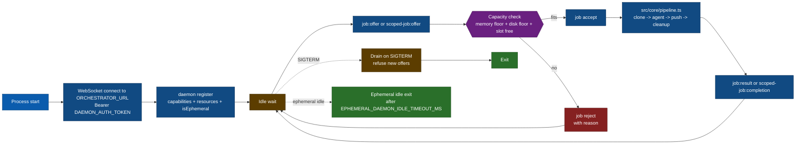
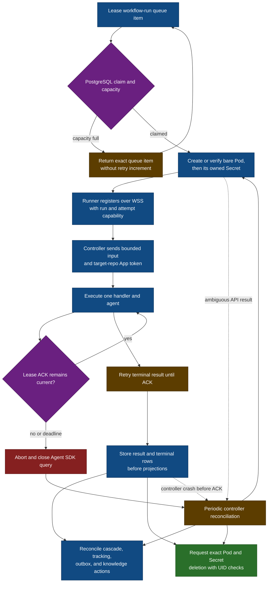
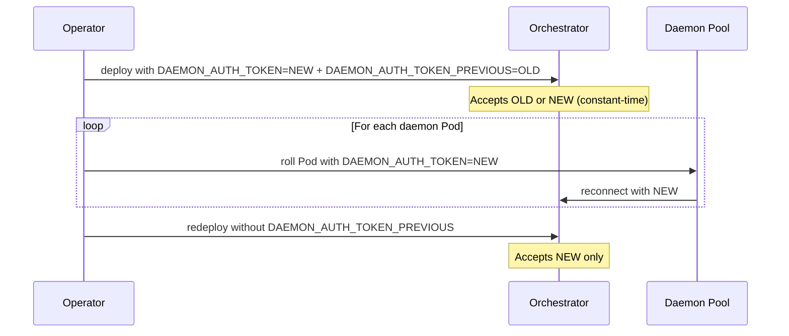

# Runbook: daemon fleet

A daemon is a shared worker process that connects to the controller over WebSocket and executes legacy or scoped jobs. Structured `workflow-run` jobs no longer enter this fleet; each one uses a separate one-attempt runner Pod. The webhook server never runs the pipeline in-process.

## Persistent vs ephemeral

Always qualify which kind you mean. The union of both at any given moment is the **daemon fleet**.

| Type           | How it starts                                                        | Lifetime                                                                         | `DAEMON_EPHEMERAL` |
| -------------- | -------------------------------------------------------------------- | -------------------------------------------------------------------------------- | ------------------ |
| **Persistent** | Deployed out-of-band (Helm, kubectl, `docker run`, systemd).         | Long-lived; stays connected until `SIGTERM` or eviction.                         | unset / `false`    |
| **Ephemeral**  | Spawned on demand by the orchestrator as a bare Pod via the K8s API. | Exits after `EPHEMERAL_DAEMON_IDLE_TIMEOUT_MS` (default 120 s) of no active job. | `true`             |

Only persistent daemons count toward the "persistent pool free slots" the orchestrator uses to decide whether an overflow spawn is warranted. Ephemeral daemons exist specifically to drain the current surge and disappear.

## Daemon lifecycle



At boot, before connecting to the orchestrator, the daemon sweeps stale workspace triples (clone dir + `.cred.sh` token helper + `-artifacts`) older than `WORKSPACE_STALE_TTL_MS` under `CLONE_BASE_DIR`, reclaiming SIGKILL/OOM/eviction orphans left behind when a prior run skipped its own cleanup. Each sweep emits a single `workspace.sweep` log line with `swept` / `retained` / `durationMs`.

Every boot generates a new daemon ID, including a container restart inside the same Kubernetes Pod. On disconnect, the controller immediately removes the socket from its local heartbeat and dispatch state, then starts serialized asynchronous cleanup. Same-ID registration waits for that cleanup. One PostgreSQL transaction marks the exact incarnation inactive, fails its attempt-less workflow rows and queued/offered/running execution receipts, records pending public-failure projections, and releases matching scheduled-action locks. The controller projects those receipts immediately and retries missed projections from PostgreSQL, then removes the best-effort Valkey registry entry. The liveness reaper is the database fallback when a close callback is lost. Structured workflow rows use the isolated-runner lease path below instead of daemon heartbeat identity.

## Isolated workflow-runner lifecycle



The attempt Pod references exactly one selected provider credential chain from `workflow-runner-secrets` and a separate Secret containing only its HMAC capability. The controller signs that deadline-bound capability with `WORKFLOW_RUNNER_CAPABILITY_SECRET`, which is never mounted on a shared daemon or runner, and owns the Secret with the exact Pod UID. Provider settings are inline and unused or cross-provider credentials are omitted. The target-repository installation token crosses the first WSS registration only after its GitHub-reported expiry is proven no later than the immutable attempt deadline. Reconnects carry no job payload or repository credential. The runner receives no App private key, PAT, database, Valkey, Kubernetes, Context7, global GitHub, or fleet-wide daemon credential. If `GITHUB_PERSONAL_ACCESS_TOKEN` is configured, structured workflow dispatch fails closed; legacy and scoped jobs are unchanged.

The runner renews a PostgreSQL lease through heartbeats. Missing lease ACK, token deadline, explicit cancellation, or the 4,200-second Pod deadline stops local execution. The Pod uses `restartPolicy: Never` because the durable payload receipt prohibits credential reissue after a process crash. Catchable exits and controller-owned token paths attempt best-effort revocation with a ten-second GitHub API timeout, then continue terminal handling even if revocation fails. The exact repository token is not persisted, so a failed revocation, SIGKILL, or node loss leaves a repository-scoped residual until its authoritative expiry. The controller stores the terminal payload and both terminal rows before ACK. Projection and exact resource cleanup then reconcile independently from PostgreSQL, so a failing GitHub projection does not retain runner credentials or compute. GitHub API calls and git pushes remain at-least-once: after an interrupted attempt, inspect the repository before manually re-triggering it.

One controller replica is the supported topology. The database capacity transaction is safe against duplicate queue items, but there is no distributed controller-session owner or multi-replica admission semaphore.

## Operational knobs

The full list lives at [`../configuration.md`](../configuration.md#orchestrator-and-daemon). The handful you'll actually touch:

| Variable                                     | Default              | Notes                                                                                                      |
| -------------------------------------------- | -------------------- | ---------------------------------------------------------------------------------------------------------- |
| `ORCHESTRATOR_URL`                           | _none_               | Required. `wss://` in production; `ws://` emits a warning.                                                 |
| `DAEMON_AUTH_TOKEN`                          | _none_               | Shared secret with the orchestrator.                                                                       |
| `WORKFLOW_RUNNER_CAPABILITY_SECRET`          | _none_               | Controller-only root for expiring per-attempt capabilities. Minimum 32 characters.                         |
| `WORKFLOW_RUNNER_CAPABILITY_SECRET_PREVIOUS` | _none_               | Optional controller-only predecessor during capability rotation.                                           |
| `DAEMON_EPHEMERAL`                           | `false`              | `true` on ephemeral daemon Pods (injected by the spawner). Enables idle-exit.                              |
| `EPHEMERAL_DAEMON_IDLE_TIMEOUT_MS`           | `120000`             | Ephemeral daemons exit after this idle window.                                                             |
| `EPHEMERAL_DAEMON_NAMESPACE`                 | `default`            | Namespace for shared ephemeral daemon Pods.                                                                |
| `WORKFLOW_RUNNER_NAMESPACE`                  | `github-app-runners` | Dedicated namespace for isolated runner Pods and Secrets. It must differ from the shared-daemon namespace. |
| `WORKFLOW_DISPATCH_TIMEOUT_MS`               | `4200000`            | Fails an unclaimed queued workflow and releases its lock after this age.                                   |
| `HEARTBEAT_INTERVAL_MS`                      | `30000`              | Ping cadence.                                                                                              |
| `HEARTBEAT_TIMEOUT_MS`                       | `90000`              | Orchestrator eviction threshold. Keep `≥ 2 × HEARTBEAT_INTERVAL_MS`.                                       |
| `DAEMON_DRAIN_TIMEOUT_MS`                    | `300000`             | Post-`SIGTERM` grace. Raise to `≥ AGENT_TIMEOUT_MS` to guarantee no mid-run kills.                         |
| `DAEMON_MEMORY_FLOOR_MB`                     | `512`                | Below this, the orchestrator skips the daemon on dispatch.                                                 |
| `DAEMON_DISK_FLOOR_MB`                       | `1024`               | Same, for free disk.                                                                                       |

## Persistent daemon Deployment

```yaml
apiVersion: apps/v1
kind: Deployment
metadata:
  name: github-app-daemon
  namespace: default
spec:
  replicas: 2
  selector:
    matchLabels:
      app: github-app-daemon
  template:
    metadata:
      labels:
        app: github-app-daemon
    spec:
      terminationGracePeriodSeconds: 300
      automountServiceAccountToken: false
      enableServiceLinks: false
      hostIPC: false
      hostNetwork: false
      hostPID: false
      securityContext:
        runAsNonRoot: true
        runAsUser: 1000
        runAsGroup: 1000
        seccompProfile:
          type: RuntimeDefault
      containers:
        - name: daemon
          image: chrisleekr/github-app:latest-daemon
          securityContext:
            allowPrivilegeEscalation: false
            capabilities:
              drop: ["ALL"]
          envFrom:
            - secretRef:
                name: daemon-secrets
          env:
            - name: ORCHESTRATOR_URL
              value: "wss://orchestrator.example.internal:3002"
            - name: CLONE_BASE_DIR
              value: "/workspaces"
          volumeMounts:
            - name: bot-workspaces
              mountPath: /workspaces
      volumes:
        - name: bot-workspaces
          emptyDir:
            sizeLimit: 5Gi
```

Match `terminationGracePeriodSeconds` to `DAEMON_DRAIN_TIMEOUT_MS` so `SIGTERM` has time to drain in-flight work before `SIGKILL`.

## Concurrency and scaling

A daemon process handles up to its advertised `maxConcurrentJobs` at a time. Scale **horizontally** by running multiple persistent daemon pods. The orchestrator adds ephemeral daemons for bursts (triage `heavy=true` or queue overflow), see [`../observability.md`](../observability.md#dispatch-reasons).

### Scale-up rule

On every event the orchestrator evaluates:

1. **Triage.** A single-turn Haiku call returns `{heavy, confidence, rationale}`. `heavy=true` is one trigger.
2. **Overflow.** If `queue_length ≥ EPHEMERAL_DAEMON_SPAWN_QUEUE_THRESHOLD` **and** the persistent pool has zero free slots, that's the other trigger.
3. **Cooldown.** Spawns are rate-limited by `EPHEMERAL_DAEMON_SPAWN_COOLDOWN_MS`. During cooldown, heavy/overflow signals **don't** spawn: the job falls back to `persistent-daemon` and waits.
4. **Spawn.** When both a trigger fires and cooldown has elapsed, the orchestrator creates a bare Pod via the K8s API. A K8s API failure yields `dispatch_reason=ephemeral-spawn-failed` and the job is rejected with a tracking-comment infra error.

## Hard constraints

- `AGENT_TIMEOUT_MS` must stay below the GitHub installation-token TTL (3600 s) so the daemon cannot outlive its credentials.
- `EPHEMERAL_DAEMON_IDLE_TIMEOUT_MS` should be longer than typical heartbeat cadence so a short lull between back-to-back jobs does not cause a premature exit.
- `terminationGracePeriodSeconds` on the daemon Pod should match `DAEMON_DRAIN_TIMEOUT_MS`.
- Workflow runners require GitHub App mode, a digest-pinned `DAEMON_IMAGE`, an `ORCHESTRATOR_PUBLIC_URL` that is `wss://` or a cluster-local `ws://` Service name, a controller-only `WORKFLOW_RUNNER_CAPABILITY_SECRET` that differs from both daemon-auth slots, a dedicated `WORKFLOW_RUNNER_NAMESPACE`, controller RBAC for Pods and Secrets there, one selected credential chain in `workflow-runner-secrets`, dedicated runner nodes carrying the configured `WORKFLOW_RUNNER_NODE_LABEL` label and matching taint, and the egress controls in [`deployment.md`](../deployment.md#workflow-runner-egress-boundary).
- Install the fail-closed ValidatingAdmissionPolicy from [`examples/workflow-runner-admission.yaml`](https://github.com/chrisleekr/github-app/blob/main/examples/workflow-runner-admission.yaml), or set `workflowRunner.enabled` in the Helm chart, which packages the same policy. Require a negative server-side dry-run canary to name that policy before enabling workflows. It prevents a mutated image, lifecycle hook, container override, placement override, or extra container from starting with runner credentials. Controller reconciliation is the second check.
- All three cloud metadata probes must receive no HTTP response before the runner registers. A policy drop normally surfaces as a timeout, so timeout or connection refusal is accepted as corroboration; any HTTP response is a deployment failure.
- Every eligible runner node must enforce a finite positive kubelet `podPidsLimit` plus system and Kubernetes PID reservations. See [`deployment.md`](../deployment.md#runner-node-pid-boundary).
- Treat ephemeral-storage limits as eviction thresholds, not filesystem quotas. Keep control-plane and application workloads off the dedicated runner node pool so a deleted-open-file attack cannot exhaust their disks.

## Workflow-runner rollout

Migration 017 can recover reconstructible queued rows, but it cannot safely adopt arbitrary pre-lease work already executing in a shared daemon. Use a zero-in-flight cutover:

1. Stop new GitHub webhook traffic while leaving the existing controller and daemon fleet running so current work can drain.
2. Wait until both queries return zero:

   ```sql
   SELECT count(*)
     FROM executions
    WHERE status IN ('offered', 'running');

   SELECT count(*)
     FROM workflow_runs
    WHERE status IN ('queued', 'running');
   ```

3. Gracefully stop the old controller and wait for the process to exit. This quiesces the ship tickle scheduler, scheduled actions, proposal poller, queue worker, and webhook listener. A webhook-only drain is insufficient because a due ship continuation can create new workflow work without a webhook.
4. Rerun both drain queries after the old controller is fully stopped. This is the cutover gate: no old-code producer may run between this final zero result and migration 017. If either query is non-zero, do not migrate. Restore the old version, drain or inspect that work, and repeat the stop plus final-query gate.
5. Confirm App mode is active, `GITHUB_PERSONAL_ACCESS_TOKEN` is absent, `WORKFLOW_RUNNER_CAPABILITY_SECRET` is controller-only, `DAEMON_IMAGE` ends in the tested daemon-image `@sha256:<digest>`, `ORCHESTRATOR_PUBLIC_URL` is WSS, and the RBAC, Secret, ValidatingAdmissionPolicy, ResourceQuota, and egress resources from [`../deployment.md`](../deployment.md#kubernetes-worker-requirements) exist. Require the negative admission canary to be denied by name; policy type-check completion alone is not the rollout gate.
6. Deploy migration 017 and exactly one controller replica. Do not scale horizontally.
7. Trigger one structured workflow. Verify one attempt Pod appears before its Secret, the Secret has one owner reference to that exact Pod UID, all three metadata probes receive no HTTP response, the row lease renews without moving `attempt_deadline_at`, and both terminal rows are stored. The cleanup receipt may be set when UID-preconditioned deletes are accepted; separately verify both objects eventually become absent. Projection may complete before or after cleanup.
8. Restore webhook traffic.

If either drain query is non-zero, do not roll. Determine whether the work is still active or terminalize it through the existing owner path first. Do not edit lease or generation columns by hand.

Migration 017 still fails closed if this gate is violated: it terminalizes an active shared-daemon workflow or an unreconstructable queued workflow, releases its lock, and records a retryable `migration-interrupted` public projection. That recovery behavior does not make an in-flight rollout safe, because repository operations may already have completed.

## Rotating `DAEMON_AUTH_TOKEN`

`DAEMON_AUTH_TOKEN` is a long-lived shared secret. Treat it like any other production credential: rotate on a defined cadence (OWASP guidance is **at least every 90 days**) and immediately on suspected compromise. The orchestrator's bearer-token comparison is constant-time (`crypto.timingSafeEqual`) but the secret itself still needs hygiene.

The `DAEMON_AUTH_TOKEN_PREVIOUS` slot exists so rotation does not require a synchronised fleet restart: the orchestrator accepts either token while you roll daemons one at a time.



Step-by-step:

1. **Generate** a new secret: `openssl rand -hex 32`. Persist it in your secret store next to the existing value.
2. **Stage the overlap.** Update the controller Secret to set `DAEMON_AUTH_TOKEN=<NEW>` **and** `DAEMON_AUTH_TOKEN_PREVIOUS=<OLD>`. Roll the controller. Existing daemon connections using the old secret keep authenticating, and new daemons use the new primary.
3. **Roll daemons.** Update the daemon Deployment's `daemon-secrets` to set `DAEMON_AUTH_TOKEN=<NEW>` (no `_PREVIOUS` needed, daemons only ever send the primary). Roll daemons one by one (`kubectl rollout restart deployment/github-app-daemon`). Watch `auth-failed` warn-logs in the orchestrator, they should stay flat.
4. **Drop the previous slot.** Once every connected daemon presents the new token, redeploy the controller with `DAEMON_AUTH_TOKEN_PREVIOUS` removed.
5. **Verify.** A `curl` with the old Bearer should now return `401`; a curl with the new Bearer should hit the upgrade-failed path (`500 WebSocket upgrade failed`).

Operational notes:

- The previous-token slot is **orchestrator-only**. Daemons always send the value of their own `DAEMON_AUTH_TOKEN`; setting `DAEMON_AUTH_TOKEN_PREVIOUS` on a daemon Pod has no effect.
- Keep the overlap no longer than needed for the daemon rollout. The longer two tokens authenticate, the longer a leaked old token remains usable.
- The rotation does **not** require restarting daemons simultaneously, but you do need to redeploy the orchestrator twice (once to add `_PREVIOUS`, once to remove it).

## Rotating `WORKFLOW_RUNNER_CAPABILITY_SECRET`

Rotate the isolated-runner HMAC root independently from `DAEMON_AUTH_TOKEN`:

1. Generate a new root with at least 32 random bytes and store it beside the current value.
2. Deploy the controller with `WORKFLOW_RUNNER_CAPABILITY_SECRET=<NEW>` and `WORKFLOW_RUNNER_CAPABILITY_SECRET_PREVIOUS=<OLD>`. New capabilities use `NEW`; unexpired capabilities signed with `OLD` remain valid.
3. Keep the previous slot until every runner capability minted before the rotation has reached its signed expiry and no pre-rotation runner Pod remains.
4. Redeploy without `WORKFLOW_RUNNER_CAPABILITY_SECRET_PREVIOUS`. Confirm an old capability is rejected and a newly created runner still registers.

Never copy either capability root into `daemon-secrets`, `workflow-runner-secrets`, or a per-attempt Secret. The per-attempt Secret contains only the derived, expiring capability.

## Common Day-2 issues

| Symptom                                             | Likely cause                                                                                                                                                                                                                           |
| --------------------------------------------------- | -------------------------------------------------------------------------------------------------------------------------------------------------------------------------------------------------------------------------------------- |
| Sustained heartbeat eviction                        | Daemon CPU starvation, network partition, or `HEARTBEAT_TIMEOUT_MS` too low.                                                                                                                                                           |
| `dispatch_reason=ephemeral-spawn-failed`            | Missing RBAC on `pods` in `EPHEMERAL_DAEMON_NAMESPACE`, missing `daemon-secrets`, or a control-plane issue.                                                                                                                            |
| Mid-run kills on rolling deploys                    | `terminationGracePeriodSeconds` < `DAEMON_DRAIN_TIMEOUT_MS`.                                                                                                                                                                           |
| Shared `executions.status='running'` rows piling up | A daemon died abruptly. Its per-boot ID and liveness reaper should fail direct, scoped, and workflow-linked receipts for that incarnation; check controller and daemon logs.                                                           |
| Queue item remains in `queue:processing:<id>`       | The owner heartbeat may still be live, or Valkey recovery is failing. After the 60-second heartbeat expires, a liveness pass should return the exact item to `queue:jobs`.                                                             |
| Workflow lease or attempt deadline expired          | Runner lost heartbeat ACK, reached the immutable attempt deadline, reached its token safety margin, or the controller was unavailable past the lease. Inspect GitHub state before retrying.                                            |
| Workflow dispatch deadline or retries expired       | Valkey publication or runner capacity stayed unavailable past `JOB_MAX_RETRIES` or `WORKFLOW_DISPATCH_TIMEOUT_MS`. The database fails the workflow and execution, releases the target lock, and retries its public failure projection. |
| `workflow_runner_output_scan_unavailable`           | The runner RPC secret scanner was disabled, failed, or timed out. This path fails closed. Restore the configured scanner before retrying the workflow.                                                                                 |
| Workflow runner repeatedly fails to start           | Missing Pod/Secret RBAC, provider Secret, WSS reachability, image guard, quota, or an admission mutation rejected by exact reconciliation.                                                                                             |
| Terminal runner row but Pod/Secret remains          | Kubernetes accepted deletion but graceful termination or finalizers are still pending, or cleanup is retrying. Check the exact UID and node before intervening. Never automate zero-grace force deletion.                              |

## Diagnosing ephemeral-spawn failures by kind

When `dispatch_reason=ephemeral-spawn-failed` rises, break it down with the `k8s.spawn.failed` event's `kind` field (`src/orchestrator/k8s-spawn-log-fields.ts`) instead of guessing:

- `kind: "infra-absent"`, missing `DAEMON_IMAGE`, `ORCHESTRATOR_PUBLIC_URL`, or `DAEMON_AUTH_TOKEN`, or neither `KUBERNETES_SERVICE_HOST` (in-cluster) nor `KUBECONFIG` (out-of-cluster) is set. A deploy/config regression; no transient retry will help.
- `kind: "auth-load-failed"`: a kubeconfig is present but unreadable/malformed.
- `kind: "api-rejected"`: the K8s API returned a 4xx. Usually RBAC drift on the ServiceAccount permitted to create Pods in `EPHEMERAL_DAEMON_NAMESPACE`, or a Pod-spec validation error. Check the operator RBAC and the `daemon-secrets` reference.
- `kind: "api-unavailable"`: the K8s API was unreachable (5xx / network). Usually transient control-plane unavailability.

`api_call_ms` on `k8s.spawn.succeeded` / `k8s.spawn.failed` (api-\* kinds) gives the `createNamespacedPod` round-trip latency; a rising trend with no failures suggests control-plane pressure. A high `k8s.spawn.decision_skipped reason=cooldown` rate means the cooldown guard (`EPHEMERAL_DAEMON_SPAWN_COOLDOWN_MS`) is throttling spawns under sustained heavy traffic, consider scaling the persistent pool.

## Implementation references

`src/daemon/main.ts`, `src/runner/main.ts`, `src/orchestrator/ws-server.ts`, `src/orchestrator/workflow-runner-dispatch.ts`, `src/orchestrator/workflow-runner-result.ts`, `src/k8s/ephemeral-daemon-spawner.ts`, `src/k8s/workflow-runner-spawner.ts`, `src/core/pipeline.ts`, `src/shared/ws-messages.ts`, `src/shared/workflow-runner-messages.ts`.
